# Domain: Automation and Optimization 

## Topic: EC2 Autoscaling groups 

### Task: Creating EC2 Autoscaling groups from Launch template

### Problem to Be Solved  

You are a System Engineer witch has to administrate online supermarket. Next month you are expected big sales in your company and this will generate huge traffic on the web site and overload it. So in this task you will learn how create ES2 Autoscaling group from Launch template witch will scale up and down instances (web servers) group depending on the instance CPU load. 

**NOTICE**: in the future task you will configure Application Load Balancer to load balance between the instance inside the Autoscaling group. 


### Explanation of the Solution  

Reference documentation:
- [What is Amazon EC2 Auto Scaling?](https://docs.aws.amazon.com/autoscaling/ec2/userguide/what-is-amazon-ec2-auto-scaling.html)
- [Auto Scaling groups](https://docs.aws.amazon.com/autoscaling/ec2/userguide/AutoScalingGroup.html)
- [Getting started with Amazon EC2 Auto Scaling](https://docs.aws.amazon.com/autoscaling/ec2/userguide/GettingStartedTutorial.html)
 
### Implementation Details  

We can use VPC and SGs made in previous tasks. [Launching Instances in Public and Private Subnets](https://git.epam.com/siarhei_beliakou/aws-mentoring/-/blob/master/materials/03_networking_dns_and_content_delivery/tasks/ec2.md)

**Required**: Key Pairs, VPC, Security Group 

1. Create a Launch Template:
    - Navigate to EC2 > Instances > Launch Templates

        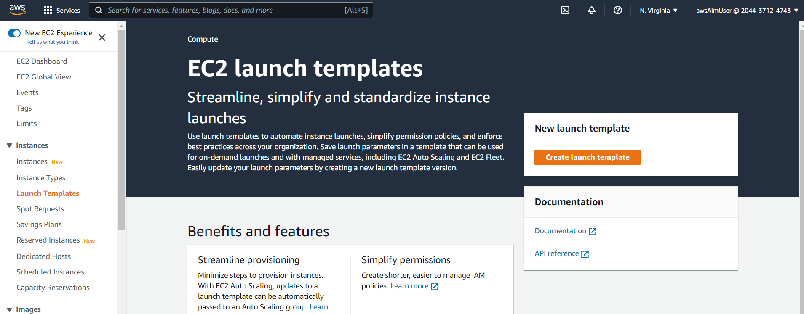

    - Click "Create launch template", call it "MyLaunchTemplate", and mark checkbox Auto Scaling guidance

        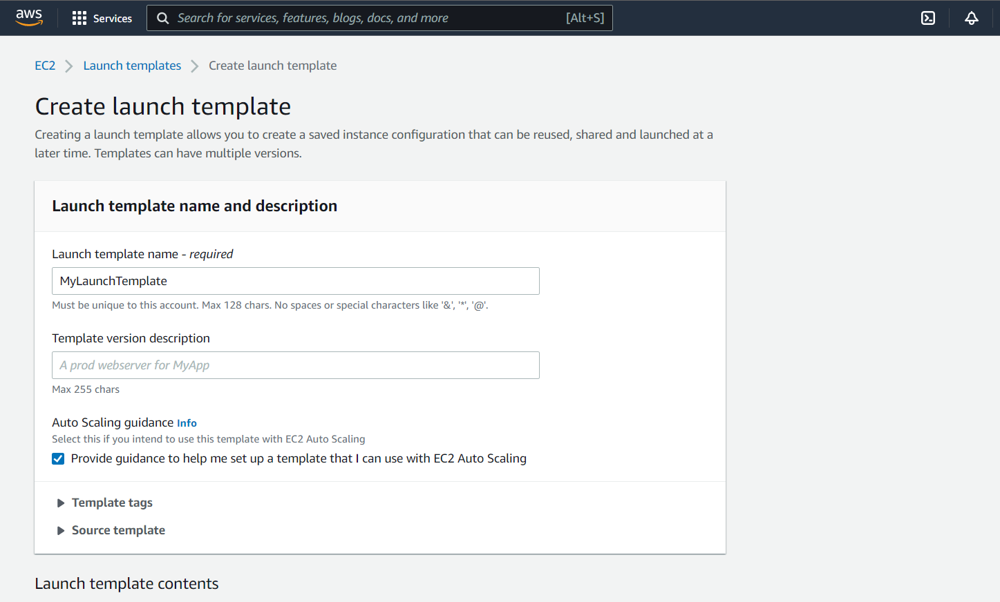

    - Select for "AMI" Amazon Linux 2 AMI (HVM) (64-bit x86) image

        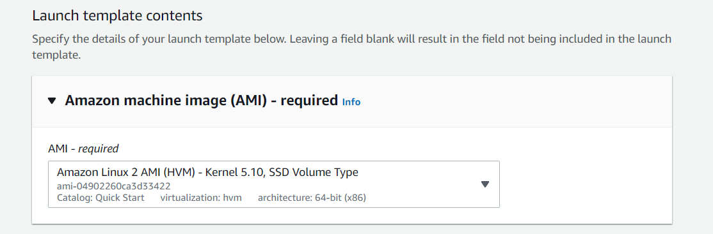 

    - Set the instance type as t2.micro 

        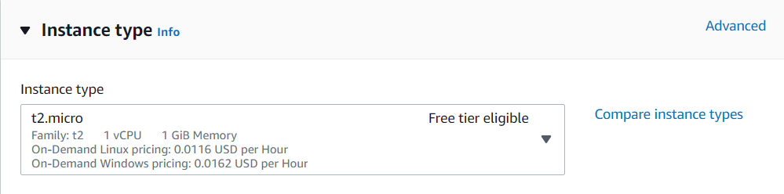 

    - Select the key pair you created earlier or create new

        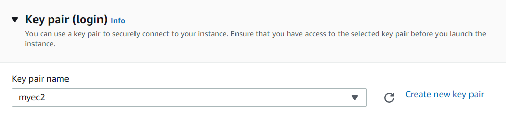 

    - Network settings set VPC and "XXXXXname" security group

        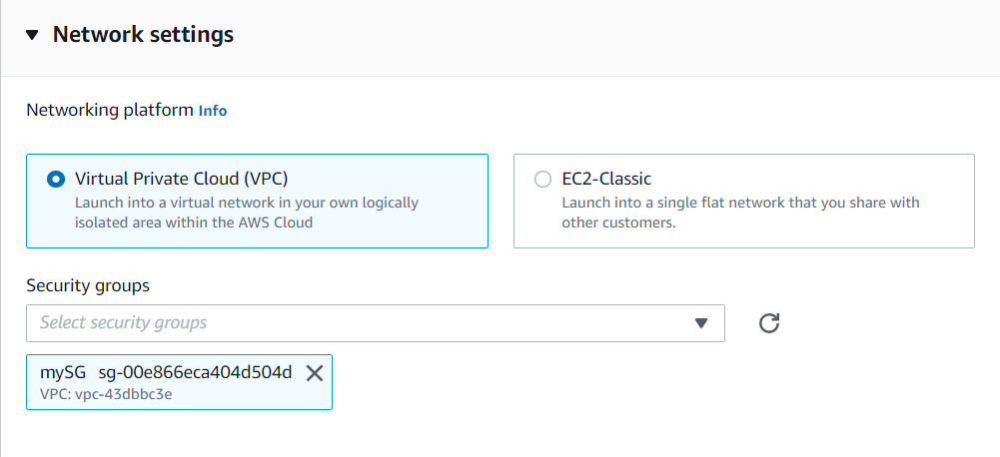 

    - Storage will be automatically set, don’t change it
    - Expand "Advanced Details", and paste in the "User data" provision script to install app. For example: "sudo yum –y install httpd"

        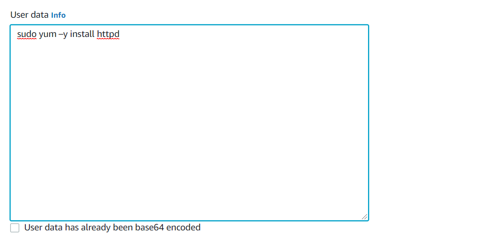

    - Click "Create Launch Template" 

        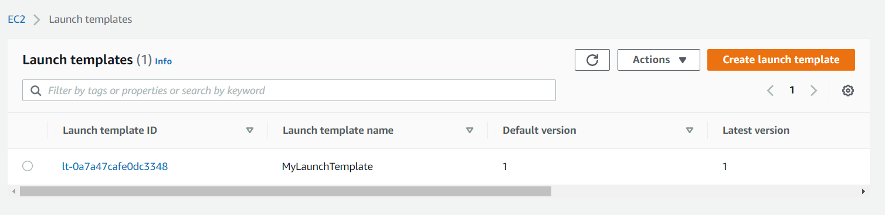

2. Create a Autoscaling group 
    - Navigate to EC2  > Auto Scaling > Auto Scaling Groups 

        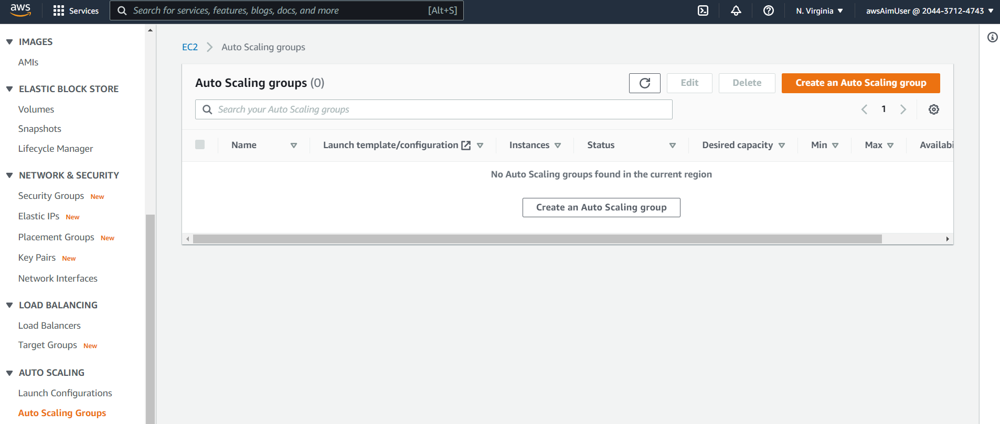

    - Click "Create an Auto Scaling group"
    - Name the group "MyASG"
    - Select "Launch Template", and choose the template you just created "MyLaunchTemplate"

        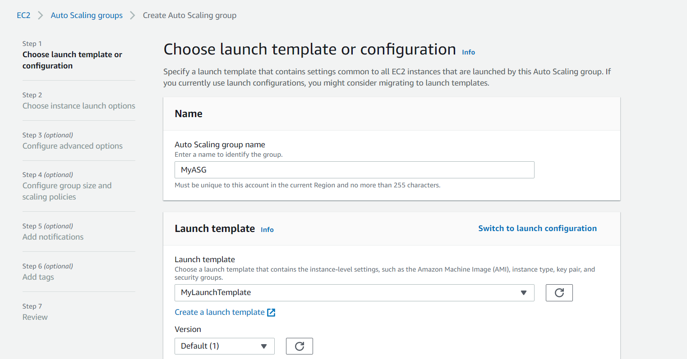

    - Version will set by "Default (1)", don’t change it and click "Next"
    - Set Network VPC "YYYYYname", Subnets "ZZZZname" and click "Next"

        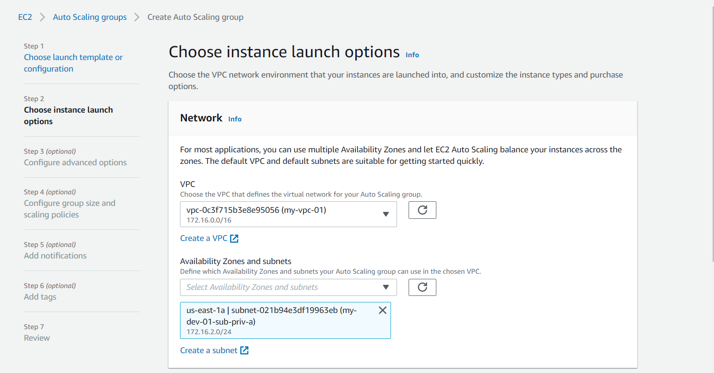

    - Load balance optional set to "No load balancer"
    - Health check don’t change
    - Additional setting don’t change and click "Next"

        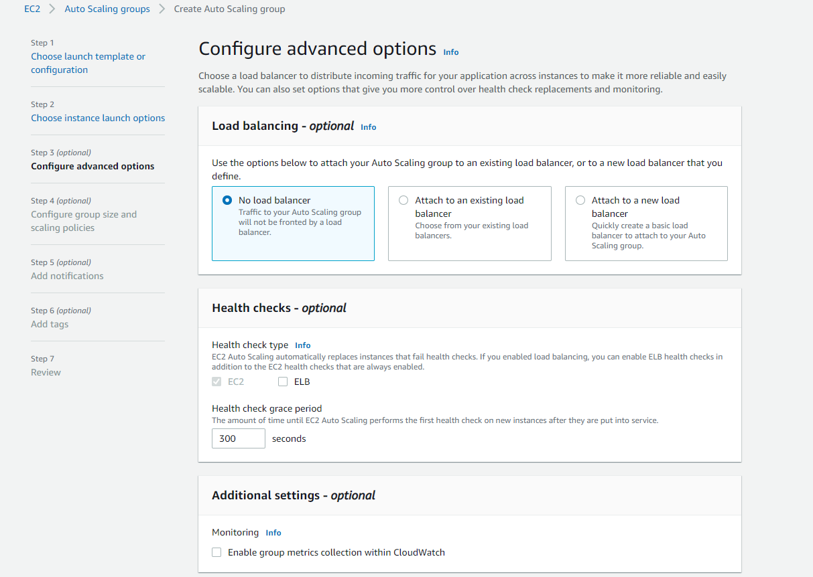

    - In Group Size enter next  
        - Desired Capacity: 1 
        - Minimum Capacity: 1 
        - Maximum Capacity: 2 
        
        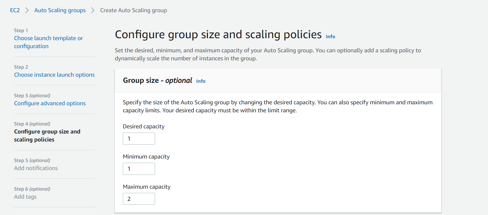

    - Scaling policies set to "Target tracking scaling policy", don’t change "Scaling policy name",  "Metric type" and "Target value" and click "Next"

        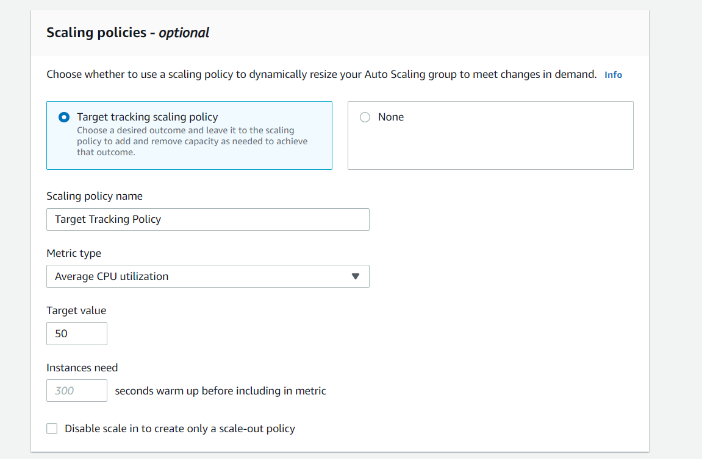

    - Don’t change Notifications and click "Next"
    - Don’t add Tags and click "Next"
    - Check review and click "Create Auto Scaling group"

        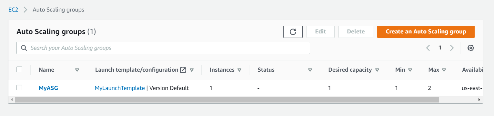
 
Get rid from autoscaling and move it to another submodule

3. Test Horizontal Scaling 
    - Connect to one of the EC2 instances via SSH (you need to use bastion like you did in previous tasks [Launching Instances in Public and Private Subnets](https://git.epam.com/siarhei_beliakou/aws-mentoring/-/blob/master/materials/03_networking_dns_and_content_delivery/tasks/ec2.md#connect-to-the-host-in-private-network))

        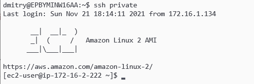

    - Install stress test utility, run:
        ```
        sudo amazon-linux-extras install epel -y
        sudo yum install -y stress 
        ```
    - Run stress test:
        ```
        stress --cpu 2 --timeout 300 
        ```
    - Wait 5-10 minutes, go to EC2 > Auto Scaling groups > MyASG click "Monitoring" then "EC2" and see "CPU Utilization" graph. Then check on the page EC2  > Instance and check the number of Runnig Instance. Also you can check "Activity History".

        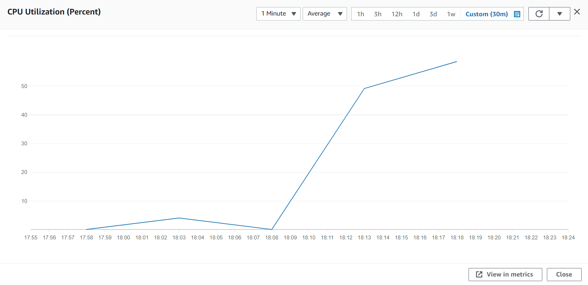

        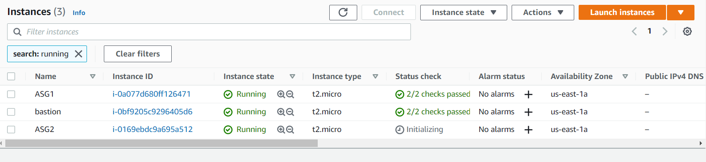

        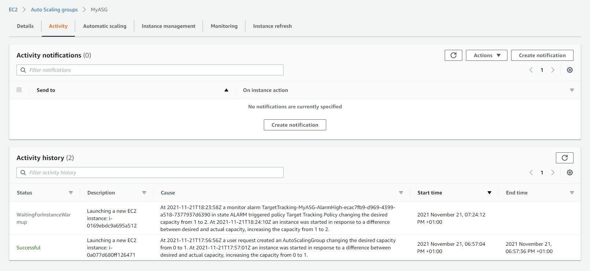
 

## Benefits / Outcomes / Pros and Cons / Summary  

(say a few words about how ASGs connected with HA) 

In this task you known how to create Auto scaling group and how to manage  the size of the Auto Scaling group by changing tracking scaling policy (CPU Utilisation). 


## Pricing  

Link to cost calculator: https://aws.amazon.com/ec2/pricing/on-demand/?nc1=h_ls 

## Tearing down  

1. Delete Auto Scaling Groups:
    - Navigate to EC2  > Auto Scaling > Auto Scaling Groups. 
    - Mark "MyASG" group and click "Delete". On the next page type in the field "delete" and click "Delete". 
2. Delete Launch Templates:
    - Navigate to EC2  > EC2 > Instances > Launch Templates. 
    - Mark "MyLaunchTemplate" click on "Action" and set  "Delete template". On the next page type in the field "delete" and click "Delete". 
