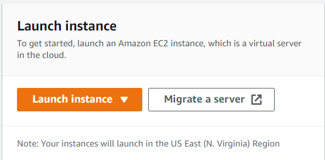
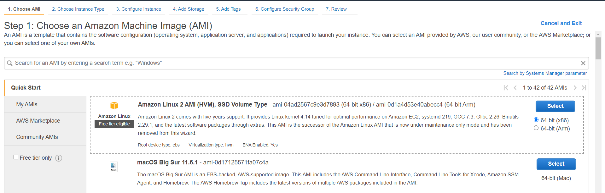
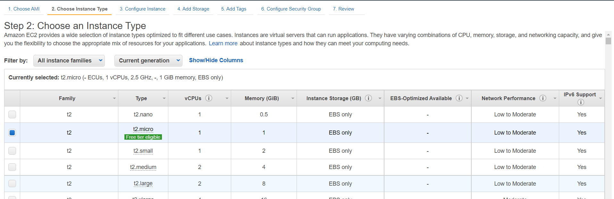
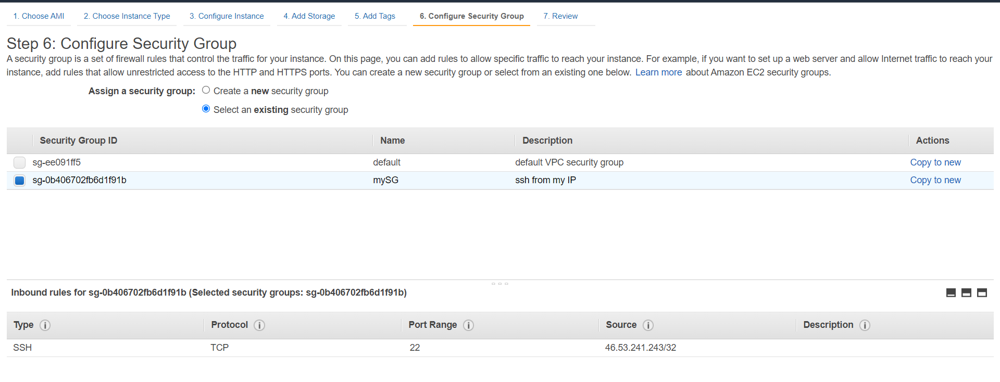
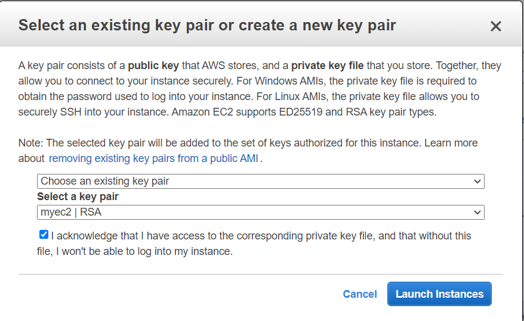
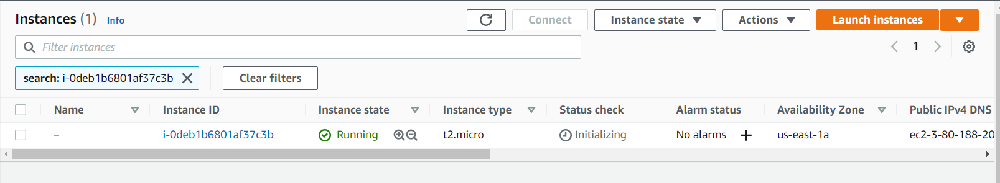
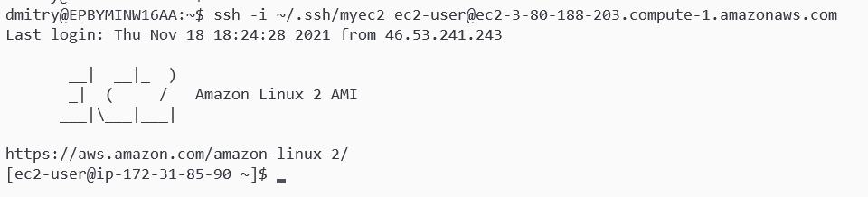

**Domain:** Compute Services

**Topic:** EC2

**Task:** Launch EC2 instance

**Problem to Be Solved:** Learn how to launch EC2 instances with required parameters

## Explanation of the Solution

- [Setup pre-requirements](https://docs.aws.amazon.com/AWSEC2/latest/UserGuide/get-set-up-for-amazon-ec2.html)
- [Instance launch](https://docs.aws.amazon.com/AWSEC2/latest/UserGuide/EC2_GetStarted.html)
- [Terminate instance](https://docs.aws.amazon.com/AWSEC2/latest/UserGuide/terminating-instances.html)

## Implementation Details

Pre-requirements:

- Create ssh-key
- Create security group to allow access to port 22 from your ip address (see the explanation above)

Launch instance:

1. From the console dashboard, navigate to EC2 Service and choose **Launch Instance**  

    

2. Choose an **Amazon Machine Image**(AMI) with the following name "Amazon Linux 2 AMI"

    

3. Choose an **Instance Type** and select t2.micro

    

4. **Instance Details**, **Storage**, **Tags** leave by default
5. Choose a **Security Group** and select SG that you created on Pre-requirements stage

    

6. On the Review Instance Launch page, choose **Launch**
7. When prompted for a key pair, select **Choose an existing key pair**, then select your key pair that you created on Pre-requirements stage

    

8. Locate your instance in **Instances** navigation pane

    

Connect to the instance

1. Copy Public DNS name of your instance (Instances > Column "Public IPv4 DNS")
2. From bash console type `ssh -i your_ssh_key ec2-user@ec2_instance_public_dns_name`

    

3. Observe instance root directory with `ls` command
4. Type `exit` to disconnect from the instance

## Benefits / Outcomes / Pros and Cons / Summary

This simple task shows you how to launch standalone EC2 instance with defined shape and image.

## Tearing down

Terminate instance(see the explanation above), security group and ssh-key.
