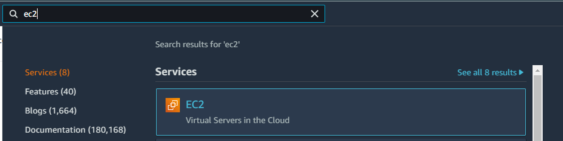
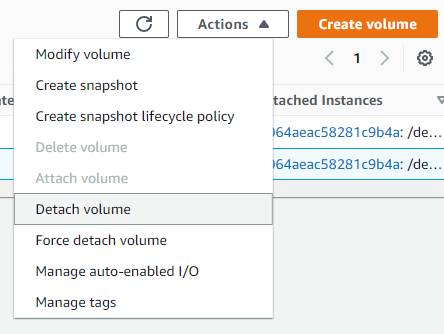
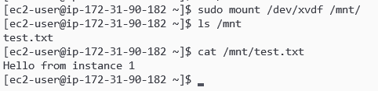

# EBS
## Creation, attachment and detachment of volume

1. Create EC2 instance how you did it in lab [Launch EC2 instance](https://git.epam.com/siarhei_beliakou/aws-mentoring/-/blob/master/materials/04_compute_services/tasks/Launch_EC2_instance.md)

2. Volume creation
- Go to EC2 console

- Navigate to Elastic Block Store > Volumes

- Click "Create Volume" button

- In "Volume Type" drop-down menu choose "General Purpose SSD (gp2)"
- In "Size" type 10
- In "Availability Zone" drop-down menu choose the availability zone your instance is running in
- Click "Add tag" button and add tag with key "Name" and value "Test volume"

- Click "Create Volume" button

3. Volume attachment
- After volume created, navigate to EC2 > Elastic Block Store > Volumes
- Choose your new "Test Volume" volume

- Click "Actions" button and choose attach volume

- Choose instance ID and device ID for volume mapping

- Click "Attach button"
- Wait until volume state is "in-use"

4. Volume mount and filesystem setup
- Navigate to EC2 > Instances > Instances
- Click on your instance ID
- Click "Connect" button

- Choose "SSH Client" and go through the instructions

- Connect to the instance
- Check if the operating system sees your volume as block device `sudo lsblk`

- Create new partition or format the whole disk `sudo mkfs.xfs /dev/xvdf`

- Mount the formatted volume to the desired mount point: `sudo mount /dev/xvdf /mnt/`
- Create text file and insert some text in it: `echo 'Hello from instance 1' > test.txt`
- Copy the file to the volume: `sudo cp test.txt /mnt/`

- Unmount volume: `sudo umount /mnt/`

5. Volume detachment
- Return to EC2 console
- Navigate to EC2 > Elastic Block Store > Volumes
- Choose your new "Test Volume" volume
- Click "Actions" button and choose detach volume 

- Wait until volume state is "available"

6. Instance termination
- Navigate to EC2 > Instances > Instances
- Choose your instance ID
- Click "Instance State" button
- Choose "Terminate Instance"

- Click "Terminate" button

7. Creation of new instance and volume attachment
- Create new instance in the same availability zone
- After instance creation attach volume to the instance and mount it to the mount point
> Please note, you do not need to reformat the volume. Just mount it.
- Ensure the file from instance 1 still exists on the volume and the data persists

`sudo mount /dev/xvdf /mnt/`

`sudo ls /mnt`

`sudo cat /mnt/test.txt`

8. Clean-up procedures
- Detach the volume
- Terminate instance
- Navigate to EC2 > Elastic Block Store > Volumes
- Choose your new "Test Volume" volume
- Click "Actions" button and choose "Delete volume" 

- Click "Yes, delete" button

