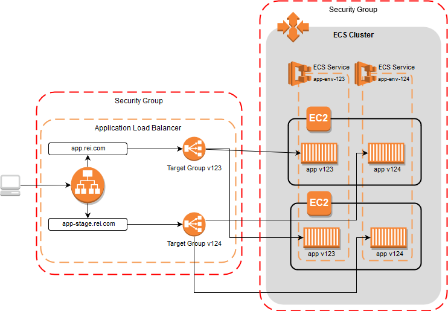

# AWS Container Services

## Table of Content
- [Your goals](#module-goals)
- [ECR](#elastic-container-registry-ecr)
- [ECS](#elastic-container-service-ecs)
- [EKS](#amazon-elastic-kubernetes-service-eks)

## Your Goals:

On a high level:

- Be able to name and briefly explain all AWS services to run Docker Containers
- Be able to explain how AWS charges Container services
- Understand lifecycle policies, image replication, image scanning and tag mutability 
- Be able to explain ECS Clusters, Services, Tasks. Deployment and Distribution strategies. 
- Understand AWS Elastic Kubernetes Service architecture 

In details:

- How to create/configure Docker Private Registry
- How to login, pull/push images. 
- Differentiate EC2 and Fargate container engines for ECS

## Self-check

1. You dont want anyone to push a docker image with existing tag, how can you achieve that?
2. If you want to have a task that is running 100% of the time, what will you use?
3. Docker images need to be cleaned up every 30 days, what can help with that?
4. What is the difference between a task and a container?
5. What's the main benefit of using Fargate on ECS/EKS?
6. If comparing EKS with other Kubernetes solution, what does EKS offer?
7. How can you configure EKS/ECS containers to access AWS services and resources?  

## Elastic Container Registry (ECR)

**Amazon Elastic Container Registry (Amazon ECR)** is an AWS managed container image registry service. Amazon ECR supports private container image repositories with resource-based permissions using AWS IAM. This is so that specified users or Amazon EC2 instances can access your container repositories and images. You can use your preferred CLI to push, pull, and manage **Docker images**, Open Container Initiative (**OCI**) images, and **OCI compatible artifacts**. 

**Amazon Elastic Container Registry Public** is a managed AWS container image registry service that is secure, scalable, and reliable. Amazon ECR supports public image repositories with resource-based permissions using AWS IAM so that specific users can access your public repositories to push images. Developers can use their preferred CLI to push and manage Docker images, Open Container Initiative (OCI) images, and OCI compatible artifacts. Your images are publicly available to pull, either anonymously or using an Amazon ECR Public authentication token. 

Amazon ECR provides the following features: 

- **Lifecycle policies** help with managing the lifecycle of the images in your repositories. You define rules that result in the cleaning up of unused images. You can test rules before applying them to your repository. For more information, see [Lifecycle policies](https://docs.aws.amazon.com/AmazonECR/latest/userguide/LifecyclePolicies.html)

- Image scanning helps in identifying software vulnerabilities in your container images. Each repository can be configured to scan on push. This ensures that each new image pushed to the repository is scanned. You can then retrieve the results of the image scan. For more information, see [Image scanning](https://docs.aws.amazon.com/AmazonECR/latest/userguide/image-scanning.html)

- Cross-Region and cross-account replication makes it easier for you to have your images where you need them. This is configured as a registry setting and is on a per-Region basis. For more information, see [Private registry settings](https://docs.aws.amazon.com/AmazonECR/latest/userguide/registry-settings.html)

**Amazon ECR** is often used as source point for **ECS** and **EKS** workflows. It can perfectly suit as a backup solution for your on-premise docker registry. 

### Pricing considerations 

- [Amazon Elastic Container Registry pricing ](https://aws.amazon.com/ecr/pricing/)

## Elastic Container Service (ECS)

Amazon Elastic Container Service (Amazon ECS) is the Amazon Web Service you use to run Docker applications on a scalable cluster. In this tutorial, you will learn how to run a Docker-enabled sample application on an Amazon ECS cluster behind a load balancer, test the sample application, and delete your resources to avoid charges.

An Amazon ECS cluster is a logical grouping of **tasks** (a logical group of containers running on an instance) or **services** (a scheduling logic that decides when and where containers should run in your cluster)

**AWS Fargate Support**

AWS Fargate technology is available with Amazon ECS. With AWS Fargate, you no longer have to select Amazon EC2 instance types, provision and scale clusters, or patch and update each server. You do not have to worry about task placement strategies, such as binpacking or host spread and tasks are automatically balanced across availability zones. Fargate manages the availability of containers for you. You just define your application’s requirements, select Fargate as your launch type in the console or CLI, and Fargate takes care of all the scaling and infrastructure management required to run your containers.
<!-- 
You can run them by choosing on of the following launch types:

- Using the Fargate launch type
- Using the EC2 launch type

Please get [more details here](https://docs.aws.amazon.com/AmazonECS/latest/developerguide/application_architecture.html). 
-->

### ECS on EC2 vs Fargate - Technical comparison
| Amazon EC2 | AWS Fargate |
| ----------- | ----------- |
|Need to manage EC2 instances|Easier management|
|Flexible configuration of task resources|Fixed vCPU - RAM combinations (min 521 MB)|
|Limited tasks per instance|No need to watch task limits|
|Flexible network options|Only **awsvpc** mode - ALB: Target Type = IP |
|Persistent volumes|Non-persistent storage only|
|Charged per EC2 resources|Charged per vCPU/RAM, used since docker pull till task termination|
|Supports EC2 Spot Instances|Supports Fargate Spot|

### Getting started Videos:

- [Amazon ECS: Core Concepts](https://youtu.be/eq4wL2MiNqo)
- [Writing Task Definitions for Amazon ECS](https://youtu.be/o_qSS4S1g34)
- [Task Placement with Amazon ECS](https://youtu.be/8XwNPX4AV2M)
- [Amazon ECS: Load Balancing for Containers](https://youtu.be/hu7SyJHWJZ0)
- [Amazon ECS: Autoscaling for Containers](https://youtu.be/YEvU6uIckDc)

## Amazon Elastic Kubernetes Service (EKS)

**EKS** stands for **Elastic Kubernetes Service**, which is an Amazon offering that helps in running the Kubernetes on AWS without requiring the user to maintain their own Kubernetes control plane. It is a fully managed service by Amazon.

Amazon EKS helps run Kubernetes control plane instances over multiple Availability Zones which makes sure that they are highlyavailable. Amazon EKS automatically detects and replaces control plane instances that are unhealthy, as well as provisioning automated version upgrades and patching for the unhealthy control planes.  

Amazon EKS can be integrated with other Amazon service in order to provide scalability and security for user applications, and some of the services have been listed below: 

- Authentication is served by IAM. 
- Isolation is served by Amazon VPC.  
- Amazon ECR for container images.  
- Elastic Load Balancing service to distribute the load. 

Amazon EKS helps run up-to-date version of the open-source Kubernetes software, thereby allowing the user to use all the existing plugins and tooling which is availability in the Kubernetes community. Applications that run on Amazon EKS are completely compatible with applications which run on other standard Kubernetes environment, be it running in on premise data centres or in public clouds. This indicates that the user can migrate to other standard Kubernetes application very easily without modifying any code. 

### Amazon EKS Control Plane Architecture
Amazon EKS runs along with a single tenant Kubernetes control plane for every cluster. This control pane infrastructure can’t be shared with other clusters or AWS accounts. The control plane consists of a minimum of two API server nodes and three ‘etcd’ nodes which run across three Availability Zones which is present in a Region. 

EKS runs the Kubernetes control plane across multiple AWS Availability Zones, automatically detects and replaces unhealthy control plane nodes, and provides on-demand, zero downtime upgrades and patching. EKS offers a 99.95% uptime SLA. At the same time, the EKS console provides observability of your Kubernetes clusters so you can identify and resolve issues faster.

EKS automatically applies the latest security patches to your cluster’s control plane. AWS works closely with the community to address critical security issues and help ensure that every EKS cluster is secure.

**Serverless Compute**

EKS supports AWS Fargate to run your Kubernetes applications using serverless compute. Fargate removes the need to provision and manage servers, lets you specify and pay for resources per application, and improves security through application isolation by design.

### When to use ECS on EC2 or Fargate mode?
| Amazon EC2 | AWS Fargate |
| ----------- | ----------- |
|Good for high resource utilization|Great for one-time tasks|
|Need to manage, secure and patch OS, AMI, etc.|Serverless|
|Large workload, optimized for price|Batch tasks|
|Windows-based containers, persistent storage|Scheduled Tasks|
||Tasks with unpredictable load spikes|

### ECS or EKS?
| Amazon ECS | AWS EKS |
| ----------- | ----------- |
|Lower cost|Full control|
|Simplicity - Require less expertise and operational knowledge|Flexibility - Requires Solid k8s knowledge|
|Greater AWS integration & IAM security|Platform agnostic*|
|AWS proprietary technology. Potential vendor lock-in. Not portable. | Open-source. Full portability between different clouds.*|
|Limited community assistance. Corporate AWS support.|Vibrant ecosystem and community*|
|When Kubernetes is too much|When you want more control over your tooling|
|Easy to deploy|Moderate effor to deploy (AWS and k8s knoledge required)|
|You can run ECS tasks on AWS Fargate|You can run Kubernetes pods on AWS Fargate|

*EKS - is an AWS proprietary technology as well. You should understood that you couldn't get the same experience with Kubernetes clusters from other cloud providers. There are a lot of AWS-specific features like ALB-ingress, IP-addressing, managed node groups, etc. AWS owns and control the process of providing features(or fixing bugs) for controls plain, addons and worker nodes. Limited number of Kubernetes releases are available. You are not able to control the master plane.

### Pricing considerations 

With AWS EKS, you have to pay for: 
- EC2/Fargate instances deployed 
- Volumes attached to them 
- EKS cluster itself  

More info can be found on [AWS EKS pricing page](https://aws.amazon.com/eks/pricing/)

### More details 

- https://www.youtube.com/watch?v=7vxDWDD2YnM  
- https://videoportal.epam.com/playlist/PaKAnOR0
