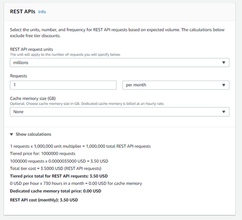

## Domain: Deployment and Provisioning
### Topic: API Gateway 
#### Service description
Amazon API Gateway is a fully managed service that makes it easy for developers to create, publish, maintain, monitor, and secure APIs at any scale. APIs act as the &quot;front door&quot; for applications to access data, business logic, or functionality from your backend services. Using API Gateway, you can create RESTful APIs and WebSocket APIs that enable real-time two-way communication applications. API Gateway supports containerized and serverless workloads, as well as web applications.

API Gateway handles all the tasks involved in accepting and processing up to hundreds of thousands of concurrent API calls, including traffic management, CORS support, authorization and access control, throttling, monitoring, and API version management. API Gateway has no minimum fees or startup costs. You pay for the API calls you receive and the amount of data transferred out and, with the API Gateway tiered pricing model, you can reduce your cost as your API usage scales.

API Gateway creates RESTful APIs that:

- Are HTTP-based.
- Enable stateless client-server communication.
- Implement standard HTTP methods such as GET, POST, PUT, PATCH, and DELETE.

#### Use cases

There are two kinds of developers who use API Gateway: API developers and app developers.

An API developer creates and deploys an API to enable the required functionality in API Gateway. The API developer must be an IAM user in the AWS account that owns the API.

An app developer builds a functioning application to call AWS services by invoking a WebSocket or REST API created by an API developer in API Gateway.

The app developer is the customer of the API developer. The app developer doesn&#39;t need to have an AWS account, provided that the API either doesn&#39;t require IAM permissions or supports authorization of users through third-party federated identity providers supported by [Amazon Cognito user pool identity federation](https://docs.aws.amazon.com/cognito/latest/developerguide/). Such identity providers include Amazon, Amazon Cognito user pools, Facebook, and Google.

With API Gateway, you can launch new services faster and with reduced investment so you can focus on building your core business services. API Gateway was built to help you with several aspects of creating and managing APIs:

##### 1) Metering
API Gateway helps you define plans that meter and restrict third-party developer access to your APIs. You can define a set of plans, configure throttling, and quota limits on a per API key basis. API Gateway automatically meters traffic to your APIs and lets you extract utilization data for each API key.

##### 2) Security
API Gateway provides you with multiple tools to authorize access to your APIs and control service operation access. API Gateway allows you to leverage AWS administration and security tools, such as AWS Identity and Access Management (IAM) and Amazon Cognito, to authorize access to your APIs. API Gateway can verify signed API calls on your behalf using the same methodology AWS uses for its own APIs. Using custom authorizers written as AWS Lambda functions, API Gateway can also help you verify incoming bearer tokens, removing authorization concerns from your backend code.

##### 3) Resiliency
API Gateway helps you manage traffic with throttling so that backend operations can withstand traffic spikes. API Gateway also helps you improve the performance of your APIs and the latency your end users experience by caching the output of API calls to avoid calling your backend every time.

##### 4) Operations Monitoring
After an API is published and in use, API Gateway provides you with a metrics dashboard to monitor calls to your services. The API Gateway dashboard, through integration with Amazon CloudWatch, provides you with backend performance metrics covering API calls, latency data and error rates. You can enable detailed metrics for each method in your APIs and also receive error, access or debug logs in CloudWatch Logs.

##### 5) Lifecycle Management
After an API has been published, you often need to build and test new versions that enhance or add new functionality. API Gateway lets you operate multiple API versions and multiple stages for each version simultaneously so that existing applications can continue to call previous versions after new API versions are published.

##### 6) Designed for Developers
API Gateway allows you to quickly create APIs and assign static content for their responses to reduce cross-team development effort and time-to-market for your applications. Teams who depend on your APIs can begin development while you build your backend processes.

##### 7) Real-Time Two-Way Communication
Build real-time two-way communication applications such as chat apps, streaming dashboards, and notifications without having to run or manage any servers. API Gateway maintains a persistent connection between connected users and enables message transfer between them.

#### Limits 
The following quotas apply per account, per Region in Amazon API Gateway.

| **Resource or operation** | **Default quota** | **Can be increased** |
| --- | --- | --- |
| Throttle quota per account, per Region across HTTP APIs, REST APIs, WebSocket APIs, and WebSocket callback APIs | 10,000 requests per second (RPS) with an additional burst capacity provided by the [token bucket algorithm](https://en.wikipedia.org/wiki/Token_bucket), using a maximum bucket capacity of 5,000 requests. **\***** Note:** The burst quota is determined by the API Gateway service team based on the overall RPS quota for the account in the Region. It is not a quota that a customer can control or request changes to. | Yes |
| Regional APIs | 600 | No |
| Edge-optimized APIs | 120 | No |

\* For the Africa (Cape Town) and Europe (Milan) Regions, the default throttle quota is 2500 RPS and the default burst quota is 1250 RPS.

All quotas for each type of API Gateways type can be found on this [page](https://docs.aws.amazon.com/apigateway/latest/developerguide/limits.html).

### Task: Creating API Gateway

### Problem to Be Solved 

You are a systems engineer. Your development team asked you to make an entry point to a serverless application created earlier through an AWS Lambda crevice. As the application will be updated, they need to be able to deploy different versions for testing it.

**NOTICE** : in this task you will work with the Lambda function you created earlier.

### Explanation of the Solution 

[https://docs.aws.amazon.com/apigateway/latest/developerguide/welcome.html](https://docs.aws.amazon.com/apigateway/latest/developerguide/welcome.html)
[https://aws.amazon.com/api-gateway/faqs/?nc1=h\_ls](https://aws.amazon.com/api-gateway/faqs/?nc1=h_ls)

### Implementation Details 

1. Create an API Gateway

    1. Navigate to **API Gateway**.
    2. Click **Create API.**
    3. Select **REST API** and click **Build**.
    4. Choose **New API**. Set API name to **myAPI** and click **Create API**.
    5. On the next page click **Actions** and choose **Create Method**.
    6. Choose **ANY** method and apply yours choice by click to the check marker.
    7. On the setup page choose **Lambda Function** and below start type your function name to the Lambda Function field **&quot;myLambda&quot;** then choose the correct name.
    8. Click **Save**.
    9. On the popup windows agree with add permission to Lambda Function – click **Ok**.
    10. Click **Actions** and choose **Deploy API**.
    11. Set Deployment stage to **New Stage** , enter Stage name **prodStage** and click **Deploy**.
    12. In the left menu navigate to **Stages** and click to the **prodStage**.
    13. On the top of just opened page click the **Invoke URL**. Yours application will opened in new window. You will see next response like this:
      ```json
      {"statusCode": 200, "body": "\"Hello from Lambda!\"", "time": "\"2021-12-21 10:57:41.989515\"", "myTex": "\"No key\""}
      ```
    14. (Optional) To check how the data is processed use the following example. Replace request method with one that you have created, and replace URL with one that was used in previous step:
      ```bash
      curl --data '{"key1":"Your text here"}' --request GET  https://dak3vw9f7k.execute-api.us-east-1.amazonaws.com/prodStage
      ```
      You will see next responce like this:
      ```json
      {"statusCode": 200, "body": "\"Hello from Lambda!\"", "time": "\"2021-12-21 11:38:18.331915\"", "myTex": "\"Your text here\""}
      ```
### Benefits / Outcomes / Pros and Cons / Summary 

In this task you known how to create API Gateway entry point to the Labmda function. So, API Gateway is serverless decision how you can get access to you application. API Gateway it&#39;s availability and fault-tolerance AWS resource which makes it possible to simultaneously access several stages (versions) of the application.

Amazon API Gateway is a fully managed service that makes it easy for developers to create, publish, maintain, monitor, and secure APIs at any scale. APIs act as the &quot;front door&quot; for applications to access data, business logic, or functionality from your backend services. Using API Gateway, you can create RESTful APIs and WebSocket APIs that enable real-time two-way communication applications. API Gateway supports containerized and serverless workloads, as well as web applications.

API Gateway handles all the tasks involved in accepting and processing up to hundreds of thousands of concurrent API calls, including traffic management, CORS support, authorization and access control, throttling, monitoring, and API version management. API Gateway has no minimum fees or startup costs. You pay for the API calls you receive and the amount of data transferred out and, with the API Gateway tiered pricing model, you can reduce your cost as your API usage scales.

### Pricing

1 million API calls received free per month for 12 months with the [AWS Free Tier](https://aws.amazon.com/api-gateway/pricing/?loc=ft#Free_Tier).

Link to cost calculator: [https://aws.amazon.com/api-gateway/pricing/](https://aws.amazon.com/api-gateway/pricing/)

[https://calculator.aws/#/createCalculator/APIGateway](https://calculator.aws/#/createCalculator/APIGateway)

For example, if you have 1millions requests to the REST API per month, the invoice will be 3,5 USD

  

You pay for the API calls you receive and the amount of data transferred out and, with the API Gateway tiered pricing model, you can reduce your cost as your API usage scales.

### Tearing down 

1. DeleteAPI Gateway

    1. Navigate to **API Gateway**.
    2. Mark **myAPI** , click Actions and choose **Delete**. On the next page click **Delete**.

1. Remember to remove Lambda Function from earlier task.
