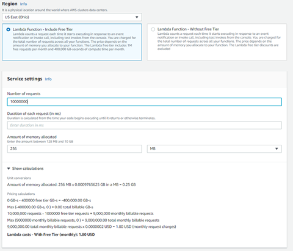

## Domain: Deployment and Provisioning

### Topic: Lambda

##### Service description

AWS Lambda is a [serverless compute](https://aws.amazon.com/serverless/) service that runs your code in response to events and automatically manages the underlying compute resources for you.

Lambda runs your code on high-availability compute infrastructure and performs all the administration of the compute resources, including server and operating system maintenance, capacity provisioning and automatic scaling, code and security patch deployment, and code monitoring and logging. All you need to do is supply the code.

The code you run on AWS Lambda is called a &quot;Lambda function.&quot; After you create your Lambda function it is always ready to run as soon as it is triggered **.** Each function includes your code as well as some associated configuration information, including the function name and resource requirements. Lambda functions are &quot;stateless,&quot; with no affinity to the underlying infrastructure, so that Lambda can rapidly launch as many copies of the function as needed to scale to the rate of incoming events.

##### Use cases

You can use AWS Lambda to extend other AWS services with custom logic, or create your own back-end services that operate at AWS scale, performance, and security. AWS Lambda can automatically run code in response to [multiple events](http://docs.aws.amazon.com/lambda/latest/dg/intro-core-components.html#intro-core-components-event-sources), such as HTTP requests via [Amazon API Gateway](https://aws.amazon.com/api-gateway/), modifications to objects in [Amazon S3](https://aws.amazon.com/s3/) buckets, table updates in [Amazon DynamoDB](https://aws.amazon.com/dynamodb/), and state transitions in [AWS Step Functions](https://aws.amazon.com/step-functions/).

After you upload your code to AWS Lambda, you can associate your function with specific AWS resources (e.g. a particular Amazon S3 bucket, Amazon DynamoDB table, Amazon Kinesis stream, or Amazon SNS notification). Then, when the resource changes, Lambda will execute your function and manage the compute resources as needed in order to keep up with incoming requests.

##### Limits

AWS Lambda is designed to run many instances of your functions in parallel. However, AWS Lambda has a default safety throttle for number of concurrent executions per account per region (visit [here](http://docs.aws.amazon.com/lambda/latest/dg/concurrent-executions.html#concurrent-execution-safety-limit) for info on default safety throttle limits). You can also control the maximum concurrent executions for individual AWS Lambda functions which you can use to reserve a subset of your account concurrency limit for critical functions, or cap traffic rates to downstream resources.
If you wish to submit a request to increase the throttle limit you can visit our [Support Center](https://aws.amazon.com/support), click &quot;Open a new case,&quot; and file a service limit increase request.

The total unzipped size of the function and all Extensions cannot exceed the unzipped deployment package size limit of 250 MB.

If resource or service limits are exceeded, AWS Lambda will try to execute the function three times.

### Task: Creating Lambda function

### Problem to Be Solved 

You are a systems engineer. The development team asked you to make an application that should show the current time of access to it. The team does not want to have head overflow with EC2 instances, the application must work serverless.

**NOTICE** : in the future task you will configure API Gateway witch will triggered this lambda function from Internet.

### Explanation of the Solution 

[https://docs.aws.amazon.com/lambda/latest/dg/getting-started.html](https://docs.aws.amazon.com/lambda/latest/dg/getting-started.html)

[https://aws.amazon.com/lambda/faqs/](https://aws.amazon.com/lambda/faqs/)

[https://www.youtube.com/watch?v=eOBq\_\_h4OJ4&amp;ab\_channel=AmazonWebServices](https://www.youtube.com/watch?v=eOBq__h4OJ4&amp;ab_channel=AmazonWebServices)

### Implementation Details 


1. Create a Lambda Function

    1. Navigate to **Lambda** > **Functions**.
    2. Click **Create function**.
    3. Choose **Author from scratch**.
    4. Set function name  **myLambda**.
    5. Select in Runtime **Python 3.7** , and click **Create function**.

1. Edit Lambda Function

    1. Navigate to **Lambda**  > **Functions** > **myLambda**.
    2. In the **Code source** after double click to **lambda-function.py** file it will be opened in the text editor.
    3. Replace all code with the following:

        ```python
        import json
        from datetime import datetime
        def lambda_handler(event, context):
            # TODO implement
            current_datetime = datetime.now()
            return {
                'statusCode': 200,
                'body': json.dumps('Hello from Lambda!'),
                'time': json.dumps(current_datetime, default=str),
                'myTex': json.dumps(event["key1"] if 'key1' in event else 'No key')
            }

        ```
    1. Click **Deploy**.

1. Test Lambda Function

    1. Navigate to **Lambda**  > **Functions** > **myLambda**.
    2. Click **Test** tab.
    3. In Test event set **New event** and enter to the Name **myEvent**.
    4. In the text editor replace all code with the following:
        ```json
        {
            "key1": "Current time"
        }
        ```      
    1. To save changes click **Save changes**.
    2. Run test press **Test**.
    3. Expand Execution result by click **Details** and you will see the next text
        ```json
        {
            "statusCode": 200,
            "body": "\"Hello from Lambda!\"",
            "time": "\"2021-04-13 08:13:58.992127\"",
            "myTex": "\"Current time\""
        }
        ```


### Benefits / Outcomes / Pros and Cons / Summary 

In this task you known how to create Lambda function, and how to test it. You also learned how you can run scripts as serverless application without EC2 instance for example.

Serverless is a way to describe the services, practices, and strategies that enable you to build more agile applications so you can innovate and respond to change faster. With serverless computing, infrastructure management tasks like capacity provisioning and patching are handled by AWS, so you can focus on only writing code that serves your customers. Serverless services like [AWS Lambda](https://aws.amazon.com/lambda/) come with automatic scaling, built-in high availability, and a pay-for-value billing model. Lambda is an event-driven compute service that enables you to run code in response to events from over 150 natively-integrated AWS and SaaS sources - all without managing any servers.

When using the Lambda function, you should remember to control the number of it executed. For example, if there is no limit on it during a DDoS attack, the bill for using this Lambda resource can greatly upset you.
Also, the price of the service depends on the time that the function is performed. We must strive to reduce it.

### Pricing 

Link to cost calculator: [https://aws.amazon.com/lambda/pricing/](https://aws.amazon.com/lambda/pricing/)

https://calculator.aws/#/createCalculator/Lambda

Example of cost calculator:




### Tearing down 
1. Delete Lambda Function

    1. Navigate to **Lambda**  >  **Functions**.
    2. Mark **myLambda** , click Actions and choose **Delete**. On the next page click &quot;**Delete**&quot;.

