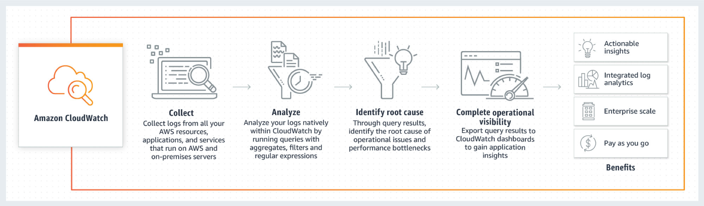

# Observability Services

## Table of Content:

- [Your goals](#your-goals)
- Examine CloudWatch
- Enhanced Monitoring with CloudWatch (EC2 and RDS)
- EventBridge
- AWS Health
- Trusted Advisor
- CloudTrail

## Your goals

- Know about CloudWatch: Logs/Metrics/Synthetics 

- Explain what AWS EventBridge is and what its use cases are

- Learn Trusted Advisor

- CloudTrail trails/events 

- Know how to view personalized information about events that can affect your AWS infrastructure using AWS Health 

## Self-check

1. What's the benefit of having CloudWatch Dashboards?
2. What monitoring features does CloudWatch provide?
3. Can you think of a use-case where EventBridge will be used?
4. What are the categories of checks Trusted Advisor provides?
5. Are API calls made from the AWS Management Console recorded by CloudTrail?

## CloudWatch 

Amazon CloudWatch monitors your Amazon Web Services (AWS) resources and the applications you run on AWS in real time. With CloudWatch, you gain system-wide visibility into resource utilization, application performance, and operational health.  

### Use cases

You can set up custom dashboards, that allow you to monitor custom metrics in a useful format. Another benefit is that you can compare some important metrics in one dashboard, which will save your time when you want to get information about your infrastructure. https://docs.aws.amazon.com/AmazonCloudWatch/latest/monitoring/create_dashboard.html 

You can gather metrics metrics from multiple regions https://docs.aws.amazon.com/AmazonCloudWatch/latest/monitoring/Cross-Account-Cross-Region.html#enable-cross-account-cross-Region 

 
### Cautions 

There are a lot of limitations in the CloudWatch service, but these are the most important: 

- Alarm actions ( 5 per alarm ) 
- Alarms ( 10/month/customer for free. 5000 per Region, per account ) 
- API requests ( 1,000,000/month/customer for free ) 
- Dashboards ( Up to 500 metrics per dashboard widget. Up to 2500 metrics per dashboard, across all widgets ) 
- Metric data storage ( 15 months ) 
- Period ( Maximum value is one day ) 
- Amazon SNS email notifications ( 1,000/month/customer for free ) 

More detailed information about limitations you can get [here](https://docs.aws.amazon.com/AmazonCloudWatch/latest/monitoring/cloudwatch_limits.html)

### Pricing considerations 

When you sign up for AWS, you can get started with CloudWatch Logs for free using the AWS Free Tier.  

Standard rates apply for logs stored by other services using CloudWatch Logs (for example, Amazon VPCflow logs and Lambda logs).   

For more information, see [Amazon CloudWatch Pricing](https://aws.amazon.com/cloudwatch/pricing/)

### More details:

- Link to the video with [creating custom dashboard](https://youtu.be/I7EFLChc07M?t=198)

## Enhanced Monitoring with CloudWatch (EC2 and RDS)

- https://www.site24x7.com/blog/amazon-ec2-monitoring-combine-cloudwatch-system-metrics
- https://docs.aws.amazon.com/AmazonRDS/latest/UserGuide/USER_Monitoring.OS.overview.html

## Amazon EventBridge

Amazon EventBridge is a serverless event bus service that makes it easy to connect your applications with data from a variety of sources. EventBridge delivers a stream of real-time data from your own applications, Software-as-a-Service (SaaS) applications, and AWS services and routes that data to targets such as AWS services like AWS Lambda or Kinesis, to an HTTP invocation endpoint using an API destination, or to the event bus in another account. To define how events are processed, you set up rules in EventBridge to define a filter pattern to match incoming events. When EventBridge receives an event with an event pattern that matches the event pattern you defined in a rule, the event is sent to the target or targets you define for the rule. 
 

EventBridge was formerly called Amazon CloudWatch Events. The default event bus and any rules you created in CloudWatch Events are also displayed in the EventBridge console. EventBridge uses the same CloudWatch Events API, so all of your existing CloudWatch Events API usage remains the same. New features added to EventBridge are not added to CloudWatch Events. 

### Use cases

Amazon EventBridge provides several features: 

1. **API Destinations**

    API Destinations is a new feature for EventBridge that enables developers to send events back to many on-prem or SaaS applications with the ability to control throughput and authentication. Customers can send events to any web-based application with a web address without worrying about writing custom code, or using additional infrastructure. 

2. **Archive and Replay Events(Allows to reprocess events)**
3. **Schema Registry**
4. **Over 100 built-in event sources and targets** (AWS Lambda, Amazon SQS, Amazon SNS, AWS Step Functions, Amazon Kinesis Data Streams, Amazon Kinesis Data Firehose, and more)
5. **Event filtering**
6. **Decoupled event publishers and subscribers**
7. **Reliable event delivery**
8. **Automatic response to operational changes in AWS Services**
9. **Scheduled events**
10. **Monitoring and auditing events**

### Governance 
EventBridge sends metrics to Amazon CloudWatch every minute. 
The AWS/Events namespace includes the following metrics: 
- `DeadLetterInvocations` 
- `FailedInvocations` 
- `Invocations` 
- `InvocationsFailedToBeSentToDlq` 
- `InvocationsSentToDlq` 
- `ThrottledRules` 
- `TriggeredRules` 
- `MatchedEvents` 
 
https://docs.aws.amazon.com/eventbridge/latest/userguide/eb-monitoring.html 
 
### Cautions 

Amazon EventBridge has the following limitations: 

- Event Publishing API requests:  depends on a region(2500 r/s – 10000 r/s) 
- Event buses: up to 100 per account 
- Invocations: depends on a region 
- Connections: 3.000 
- API destinations: 3.000 
- Rules: 300 per event bus 
- Targets: up to 5 targets per rule 

 
### Pricing considerations 
All prices are provided for US East 1(Ohio) region. 

Event Buses: 
- AWS service events: Free 
- Custom events: $1.00/million custom events published 
- Third-party (SaaS) events: $1.00/million events published 
- Cross-account events: $1.00/million cross-account events sent 

API Destinations: 
- Invocations: $0.20 per million 

Event Replay: 
Customers will be able to specify event patterns to determine which events they want to archive for replay. Customers are charged at: 
- Archive Processing: $0.10 per GB 
- Storage / Month: $0.023 per GB 

### More details 

- [EventBridge pricing](https://aws.amazon.com/eventbridge/pricing/)
- [Monitoring EventBridge](https://docs.aws.amazon.com/eventbridge/latest/userguide/eb-monitoring.html)
- [Getting started with EventBridge](https://docs.aws.amazon.com/eventbridge/latest/userguide/eb-get-started.html)
- [Events sources](https://docs.aws.amazon.com/eventbridge/latest/userguide/eb-service-event.html)
- [EventBridge tutorials](https://docs.aws.amazon.com/eventbridge/latest/userguide/eb-tutorial.html)

## AWS Health

AWS Health provides personalized information about events that can affect your AWS infrastructure, guides you through scheduled changes, and accelerates the troubleshooting of issues that affect your AWS resources and accounts.

### Considerations

- General overview: https://docs.aws.amazon.com/health/latest/ug/what-is-aws-health.html
- Personal Health Dashboard( PHD )https://docs.aws.amazon.com/health/latest/ug/getting-started-phd.html
- You can use the AWS Personal Health Dashboard to view events and affected entities and perform advanced filtering. That dashboard shows recent and upcoming events organized by category, and a full event log that shows all events from the past 90 days

### Governance:
Not required

### Pricing considerations

All customers can use PHD without pay, but customers who have a Business or Enterprise support plan can use the AWS Health API to integrate with in-house and third-party systems

https://aws.amazon.com/premiumsupport/pricing/?nc2=type_a

### AWS Workshop:

- https://intelligent-cloud-operations.workshop.aws/lab01.html

## [Trusted advisor](docs/trusted_advisor.md)

### Service Overview

AWS Trusted Advisor is an online tool that provides a real time guidance to help provision resources following AWS best practices. Trusted Advisor inspects resources across all AWS Regions and presents a summary of check results. Trusted Advisor checks help optimize AWS infrastructure, improve security and performance, reduce overall costs, and monitor service limits.

### Use cases / Considerations

Trusted Advisor includes an ever-expanding list of checks in the following five categories:

- Cost optimization – recommendations that can potentially save money by highlighting unused resources and opportunities to reduce the bill.
- Security - Trusted Advisor can improve the security of application by closing gaps, enabling various AWS security features, and examining permissions.
- Fault Tolerance - recommendations that help increase the resiliency of Amazon Web Services solution by highlighting redundancy shortfalls, current service limits, and overutilized resources.
- Performance - recommendations that can help to improve the speed and responsiveness of applications.
- Service Limits – Trusted Advisor checks for service usage that is more than 80% of the service limit.

The status of checks are:

- Red: action recommended
- Yellow: investigation recommended
- Green: no problem detected

### Cautions

Trusted Advisor Service Limits values are based on a snapshot, so current usage might differ. Limit and usage data can take up to 24 hours to reflect any changes.

### Pricing considerations

Available categories and number of checks depends on AWS support plan (Basic, Developer, Business, Enterprise).

### More details

[AWS Trusted Advisor](https://aws.amazon.com/premiumsupport/technology/trusted-advisor/)

[AWS Trusted Advisor best practice checklist](https://aws.amazon.com/premiumsupport/technology/trusted-advisor/best-practice-checklist/)

[AWS support plans](https://aws.amazon.com/premiumsupport/plans/)

---
## CloudTrail

### Service Overview

AWS CloudTrail is a service that enables governance, compliance, operational auditing, and risk auditing of your AWS account. With CloudTrail, you can log, continuously monitor, and retain account activity related to actions across your AWS infrastructure. CloudTrail provides event history of your AWS account activity, including actions taken through the AWS Management Console, AWS SDKs, command line tools, and other AWS services. This event history simplifies security analysis, resource change tracking, and troubleshooting. In addition, you can use CloudTrail to detect unusual activity in your AWS accounts. These capabilities help simplify operational analysis and troubleshooting.

### Use cases / Considerations

AWS CloudTrail allows AWS customers to record API calls, sending log files to Amazon S3 buckets for storage. The service provides API activity data including the identity of an API caller, the time of an API call, the source of the IP address of an API caller, the request parameters and the response elements returned by the AWS service.

You can get more detailed information from this links:

• General overview of CloudTrail [https://docs.aws.amazon.com/awscloudtrail/latest/userguide/cloudtrail-user-guide.html](https://docs.aws.amazon.com/awscloudtrail/latest/userguide/cloudtrail-user-guide.html)

• Actions covered by CloudTrail [https://docs.aws.amazon.com/awscloudtrail/latest/userguide/cloudtrail-concepts.html#cloudtrail-concepts-events](https://docs.aws.amazon.com/awscloudtrail/latest/userguide/cloudtrail-concepts.html#cloudtrail-concepts-events)

• CloudTrail supported services [https://docs.aws.amazon.com/awscloudtrail/latest/userguide/cloudtrail-aws-service-specific-topics.html](https://docs.aws.amazon.com/awscloudtrail/latest/userguide/cloudtrail-aws-service-specific-topics.html)

### Cautions

There are number of limitations in CloudTrail service, that you should know:

- You can have only **5** trails per region
- You have only **10** transactions per second (TPS) for Get, describe, and list APIs
- You have only **2** TPS for LookupEvents API
- You have **1** TPS for all other APIs
- Limits of Events Selectors are **5** per trail
- For all Advanced Event Selectors you have **500** conditions
- You can use **250** Data resources in event selectors across all Event Selectors in a trail
- Events over **256 KB** size can&#39;t be sent to CloudWatch Logs
- Event version **1.05** and newer has total event size limit of **256 KB**
- CloudTrail file size sent to Amazon S3 limited by **50 MB** ZIP file, after compression
- To view events for Route 53 API requests, you must choose US East (N. Virginia) in the region selector at the top of the console

You can get detailed information by this link:
[https://docs.aws.amazon.com/awscloudtrail/latest/userguide/WhatIsCloudTrail-Limits.html](https://docs.aws.amazon.com/awscloudtrail/latest/userguide/WhatIsCloudTrail-Limits.html)

### Pricing considerations

You can get started with AWS CloudTrail for free ( see [https://aws.amazon.com/free/](https://aws.amazon.com/free/) for more details about Free Tier ):

- Log and search events with Event History AWS CloudTrail logs management events across AWS services by default. You can view, search, and download the most recent 90-day history of your account&#39;s management events for free using CloudTrail in the AWS console or the AWS CLI Lookup API.
- Deliver events by creating trails You can deliver one copy of your ongoing management events to Amazon S3 for free by creating trails. This lets you store events in S3 past 90 days.

You will pay for:

- Deliver additional copies of events and data events by using trails You can deliver additional copies of events, including data events, using trails. Trails can be created for a single AWS account, or for multiple AWS accounts using AWS Organizations. See pricing in the table below.
- Identify unusual activity in your account AWS CloudTrail Insights analyzes write management event API calls in your AWS account and detects unusual activity. See pricing in the table below.

| **Feature** | **Pricing** |
| --- | --- |
| Management events delivered to S3 | First copy of management events is delivered free; additional copies: $2.00 per 100,000 management events delivered |
| Data events delivered to S3 | $0.10 per 100,000 data events delivered |
| CloudTrail Insights | $0.35 per 100,000 events analyzed |

[https://aws.amazon.com/cloudtrail/pricing/](https://aws.amazon.com/cloudtrail/pricing/)

### More details

- CloudTrail using sample

[https://docs.aws.amazon.com/awscloudtrail/latest/userguide/cloudtrail-tutorial.html](https://docs.aws.amazon.com/awscloudtrail/latest/userguide/cloudtrail-tutorial.html)

- Creating IAM user and grant him right permissions for using CloudTrail:

[https://docs.aws.amazon.com/awscloudtrail/latest/userguide/security\_iam\_id-based-policy-examples.html#grant-permissions-for-cloudtrail-administration](https://docs.aws.amazon.com/awscloudtrail/latest/userguide/security_iam_id-based-policy-examples.html#grant-permissions-for-cloudtrail-administration)
