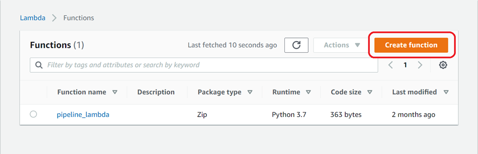
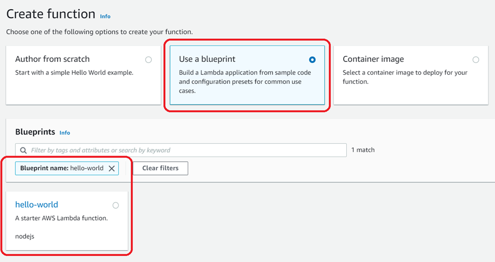
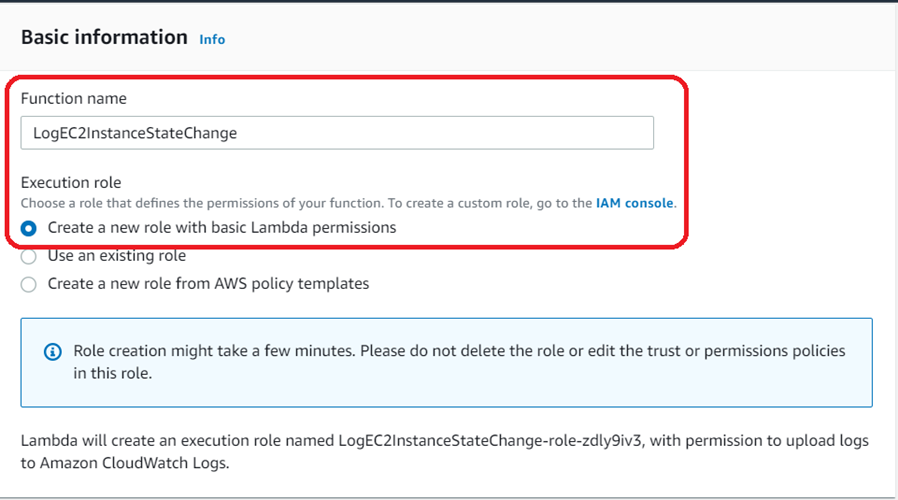
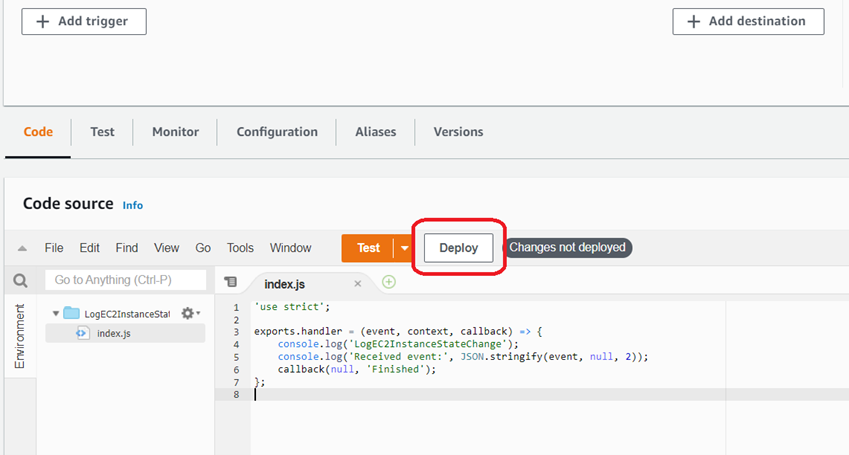
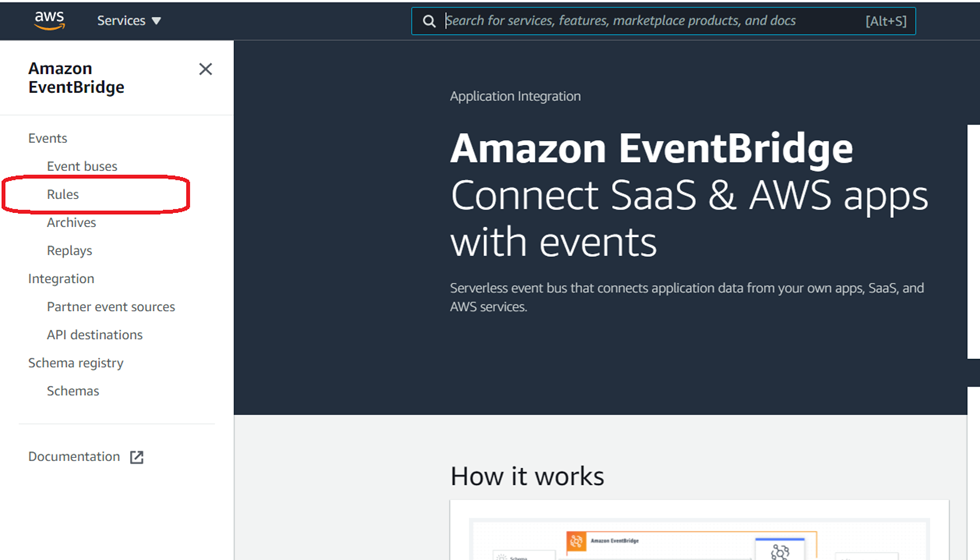
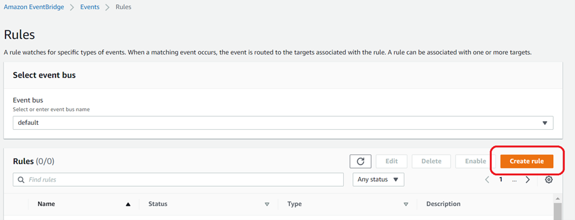
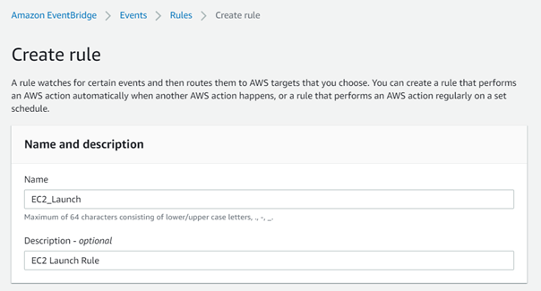
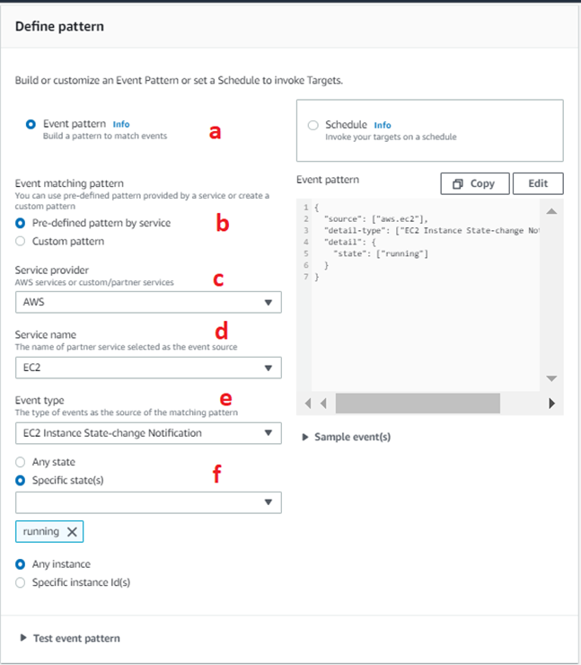
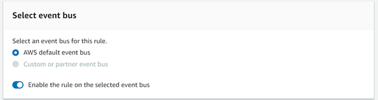
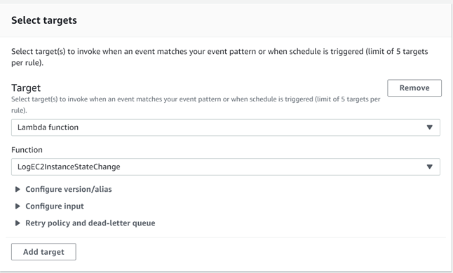

[https://docs.aws.amazon.com/eventbridge/latest/userguide/eb-log-ec2-instance-state.html](https://docs.aws.amazon.com/eventbridge/latest/userguide/eb-log-ec2-instance-state.html)

# Domain: Observability Services

## Topic: AWS EventBridge

### Task: Log the State of an Amazon EC2 Instance Using EventBridge

#### Problem to Be Solved

In this task we will create an AWS Lambda function that logs the launch of any Amazon EC2 instance in account.

#### Explanation of the Solution

Theory explanation with links to official docs

#### Implementation Details

##### Step 1: Create an AWS Lambda Function

Create a Lambda function to log the state change events. You specify this function when you create your rule.
###### To create a Lambda function

1. Open the AWS Lambda console at [https://console.aws.amazon.com/lambda/](https://console.aws.amazon.com/lambda/)
2. Choose **Create a Lambda function**

    

1. On the **Select blueprint** page, enter **hello** for the filter and choose the **hello-world** blueprint.

    

1. Press **Configure**
2. On the Configure function page, do the following:
    a. Enter a name and description for the Lambda function. For example, name the function **LogEC2InstanceStateChange**.
    b. For **Role**, choose **Create a new role with basic Lambda permissions** 

    

    c. Choose **Create function**.
1. Edit the sample code for the Lambda function:
    ```
    'use strict';
    exports.handler = (event, context, callback) => {
        console.log('LogEC2InstanceStateChange');
        console.log('Received event:', JSON.stringify(event, null, 2));
        callback(null, 'Finished');
    };
    ```

1. Press **Deploy** , to deploy new version

    

##### Step 2: Create a Rule

Create a rule to run your Lambda function whenever you launch an Amazon EC2 instance.

###### To create the EventBridge rule:

1. Open the Amazon EventBridge console at [https://console.aws.amazon.com/events/](https://console.aws.amazon.com/events/)
1. In the navigation pane, choose **Rules**.

    

1. Choose **Create rule**.

    

1. Enter a name and description for the rule.

    

1. For Define pattern, do the following:
    1. Choose **Event pattern**.
    1. Choose **Pre-defined pattern by service**.
    1. For **Service provider**, choose **AWS**.
    1. For **Service Name**, choose **EC2**.
    1. For **Event type**, choose **EC2 Instance State-change Notification**.
    1. Choose **Specific state(s), running**.
    1. By default, the rule matches any instance group in the Region.

    

1. For **Select event bus**, choose **AWS default event bus**.

    

1. For **Target** , choose **Lambda function**.

    

1. For **Function** , select the Lambda function that you created.
2. Choose **Create**.

##### Step 3: Test the Rule

To test your rule, launch an Amazon EC2 instance. After waiting a few minutes for the instance to launch and initialize, verify that your Lambda function was invoked.

### Benefits / Outcomes / Pros and Cons / Summary

Now we will log each event of creating new instance in our AWS account.

### Tearing down

1. Delete EventBridge Rule
2. Delete created AWS Lambda function
