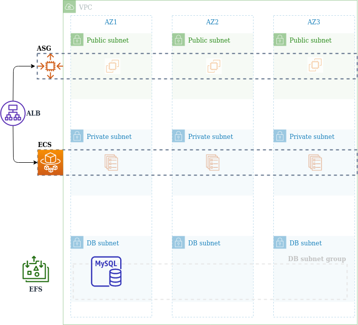

# Content

  * [Problem to Be Solved](#problem)
  * [Solution approach](#solution)
  * [Pre-requirements](#prereq)
  * [1 - Create Network stack](#network)
  * [2 - Create security groups](#sg)
  * [3 - Create Database](#db)
  * [4 - Create SSH Key pair](#ssh)
  * [5 - Store DB password in safe](#dbpassw)
  * [6 - Create IAM role](#iam)
  * [7 - Create EFS](#efs)
  * [8 - Create Application load balancer](#alb)
  * [9 - Create Launch Template](#lt)
  * [10 - Create Auto-scaling group](#asg)
  * [11 - Create ECS resources](#ecs)
  * [12 - Monitoring](#monitoring)
  * [Definition of done](#dod)

# Problem statement <a name="problem"></a>

Application solution requires high available and secure setup on AWS using DataBase, Filesystem and Compute services.


# Solutioning approach <a name="solution"></a>

- Use EFS for sharing data between compute instances 

- Use ASG and Fargate for application reliability across compute engines 

- Host application instances in 3 Availability Zones 

- Use RDS capabilities for HA DB solution (MySQL)

- Enable ALB as a single application entrypoint 

- Use Public/Private networks for secured access 

- Use strict Security Rules for enabling communication between all components of the entire stack 

- Use AWS Service(s) for managing secrets 

- Use EC2 userdata configuration for application provisioning 

- Use IAM roles and instance profiles for controlled access to AWS resources

- Use AWS CloudWatch to collect metrics and logs.

- Use Tags to mark all resources, e.g. 'Project'='CloudX'

As the core application in this task we will use [Ghost](https://ghost.org/) - a leading platform for bloggers.
You have to create complete infrastructure and deploy this application to it according to the statements above.

You can do this task following the step-by-step instructions or you can provision infrastructure on your own using this solution explanation as the requirements and then refer to instructions for self check.


## Reference Infrastructure Diagram: 



## Minimum observability requirements: 

- Avg CPU utilization for EC2 instances in ASG
- ECS Service CPU Utilization 
- ECS Running tasks count 
- EFS ClientConnections 
- EFS StorageBytes in Mb
- RDS DB connections
- RDS CPU utilization
- RDS storage read\write IOPS
- Logs should be aggregated from all sources to CloudWatch Group/Logs 
- All metrics should be arranged into CloudWatch Dashboard 


# Pre-requirements <a name="prereq"></a>

- Activated AWS account
- All modules from CloudX AWS DevOps course completed


## 1 - Create Network stack <a name="network"></a>

Create network stack for your infrastructure with the following resources:

- VPC: 
  - name=cloudx, cidr=10.10.0.0/16, enable_dns_support=true, enable_dns_hostnames=true
- 3 x Public subnets:
  - name=public_a, cidr=10.10.1.0/24, az=a
  - name=public_b, cidr=10.10.2.0/24, az=b
  - name=public_c, cidr=10.10.3.0/24, az=c
- 3 x Private subnets:
  - name=private_a, cidr=10.10.10.0/24, az=a
  - name=private_b, cidr=10.10.11.0/24, az=b
  - name=private_c, cidr=10.10.12.0/24, az=c
- 3 x Database subnets(private)
  - name=private_db_a, cidr=10.10.20.0/24, az=a
  - name=private_db_b, cidr=10.10.21.0/24, az=b
  - name=private_db_c, cidr=10.10.22.0/24, az=c
- Internet gateway (name=cloudx-igw) and attach it to appropriate VPC
- Routing table to bind Internet gateway with the Public subnets (name=public_rt)
- Routing table and attach it with the Private subnets (name=private_rt)


## 2 - Create security groups <a name="sg"></a>

Create the following security groups:

1) name=ec2_pool, description="allows access for ec2 instances":

  - ingress rule_1: port=22, source={your_ip}, protocol=tcp
  - ingress rule_2: port=2049, source={vpc_cidr}, protocol=tcp
  - ingress rule_3: port=2368, source_security_group={alb}, protocol=tcp
  - egress rule: allows any destination

2) name=fargate_pool, description="allows access for fargate instances":

  - ingress rule_1: port=2049, source={vpc_cidr}, protocol=tcp
  - ingress rule_2: port=2368, source_security_group={alb}, protocol=tcp
  - egress rule: allows any destination

3) name=mysql, description="defines access to ghost db":

  - ingress rule_1: port=3306, source_security_group={ec2_pool}, protocol=tcp
  - ingress rule_2: port=3306, source_security_group={fargate_pool}, protocol=tcp

4) name=efs, description="defines access to efs mount points":

  - ingress rule_1: port=2049, source_security_group={ec2_pool}, protocol=tcp
  - ingress rule_2: port=2049, source_security_group={fargate_pool}, protocol=tcp
  - egress rule: allows any destination to {vpc_cidr}

5) name=alb, description="defines access to alb":

  - ingress rule_1: port=80, source={your_ip}, protocol=tcp
  - egress rule 1: port=any, source_security_group={ec2_pool}, protocol=any
  - egress rule 2: port=any, source_security_group={fargate_pool}, protocol=any

6) name=vpc_endpoint, description="defines access to vpc endpoints":

  - ingress rule_1: port=443, source={vpc_cidr}, protocol=tcp


## 3 - Create Database <a name="db"></a>

Create DB related resources:

- Subnet_group: 
  - name=ghost, subnet_ids={private_db_a,private_db_b,private_db_c}, description='ghost database subnet group'

- MySQL Database: 
  - name=ghost, instance_type=db.t2.micro, engine_version=8.0, storage=gp2, allocated_space=20Gb, security_groups={mysql}, subnet_groups={ghost}


## 4 - Create SSH Key pair <a name="ssh"></a>

Create custom ssh key-pair to access your ec2 instances:(refer to this [document](https://docs.aws.amazon.com/AWSEC2/latest/UserGuide/ec2-key-pairs.html#how-to-generate-your-own-key-and-import-it-to-aws))

Uppload it to AWS with name=ghost-ec2-pool


## 5 - Store DB password in a safe way<a name="dbpassw"></a>

Generate DB password and store in in SSM Parameter store as secure string(name=/ghost/dbpassw).


## 6 - Create IAM role <a name="iam"></a>

Create IAM Role and asosiated IAM Role profile (name=ghost_app) with the following permissions:
```
"ec2:Describe*",
"ecr:GetAuthorizationToken",
"ecr:BatchCheckLayerAvailability",
"ecr:GetDownloadUrlForLayer",
"ecr:BatchGetImage",
"logs:CreateLogStream",
"logs:PutLogEvents",
"ssm:GetParameter*",
"secretsmanager:GetSecretValue",
"kms:Decrypt"
"elasticfilesystem:DescribeFileSystems",
"elasticfilesystem:ClientMount",
"elasticfilesystem:ClientWrite"
```
This IAM role provides EC2 and Fargate instances with access to the services. For test purposes it acceptable to allow "any" resource access. You would consider to restrict each service in policy with resource arn(using separate statement for each service) in the real environments.

## 7 - Create EFS <a name="efs"></a>

1) Create EFS file system resource(name=ghost_content)
2) Create EFS mount targets for each AZ and assign them with {efs} security group


## 8 - Create Application load balancer <a name="alb"></a>

- Create Application Load Balancer with 2 target groups:
  - target group 1: name=ghost-ec2,port=2368,protocol="HTTP"
  - target group 2: name=ghost-fargate,port=2368,protocol="HTTP"

-  Create ALB listener: port=80,protocol="HTTP", avalability zone=a,b,c

-  Edit ALB listener rule: action type = "forward",target_group_1_weight=50,target_group_2_weight=50


## 9 - Create Launch Template <a name="lt"></a>

In this task you have to author launch tempalate to run Ghost application with UserData script on instance start up. Use Amazon Linux 2 as the base image.

Start up script should do the following:
- install pre-requirements
- create /var/lib/ghost/content directory and mount {ghost_content} EFS volume to the instance
- download and run Ghost application
- Read DB password from the secret store

<details>
  <summary markdown="span">Script example(click to expand):</summary>

```
#!/bin/bash -xe
export HOME="/root"
SSM_DB_PASSWORD="/gh/db/pass"
GHOST_PACKAGE="ghost-4.12.1.tgz"
DB_URL=${db_url_tpl}
DB_USER="gh_user"
DB_NAME="gh_db"

REGION=$(/usr/bin/curl -s http://169.254.169.254/latest/meta-data/placement/availability-zone | sed 's/[a-z]$//')
DB_PASSWORD=$(aws ssm get-parameter --name $SSM_DB_PASSWORD --query Parameter.Value --with-decryption --region $REGION --output text)
EFS_ID=$(aws efs describe-file-systems --query 'FileSystems[?Name==`gh_data`].FileSystemId' --region $REGION --output text)

### Install pre-reqs
curl https://bootstrap.pypa.io/get-pip.py -o /tmp/get-pip.py
sudo python3 /tmp/get-pip.py
sudo /usr/local/bin/pip install botocore
curl -sL https://rpm.nodesource.com/setup_14.x | sudo bash -
sudo yum install -y nodejs
sudo npm install pm2 -g

### EFS mount
mkdir -p /var/lib/ghost/content
yum -y install amazon-efs-utils
mount -t efs -o tls $EFS_ID:/ /var/lib/ghost/content

### Configure and start ghost app
mkdir ghost
wget https://registry.npmjs.org/ghost/-/$GHOST_PACKAGE
tar -xzvf $GHOST_PACKAGE -C ghost --strip-components=1
rm $GHOST_PACKAGE && cd ghost

cat << EOF >> config.production.json
{
    "database": {
            "client": "mysql",
            "connection": {
                    "host": "$DB_URL",
                    "port": 3306,
                    "user": "$DB_USER",
                    "password": "$DB_PASSWORD",
                    "database": "$DB_NAME"
            }
    },
    "server": {
            "host": "0.0.0.0",
            "port": "2368"
    },
    "paths": {
        "contentPath": "/var/lib/ghost/content"
    }
}
EOF

rsync -axvr --ignore-existing /ghost/content/ /var/lib/ghost/content || true
chmod 755 -R /var/lib/ghost

npm install

NODE_ENV=production pm2 start /ghost/index.js --name "ghost" -i max

```

</details>

You can refer to the [application documentation](https://ghost.org/docs/config/)

Сreate Launch Templpate: 
 - (name=ghost,instance_type=t2.micro, security_group={ec2_pool.id}, key_name={ghost-ec2-pool}, userdata={your_startup_script}, iam_role_profile={ghost_app})

To check script you can run single EC2 instance using Launch Template. Don't forget to remove it after testing. 
**Hint**: you can use cloud-init log to examine userData scipt output(/var/log/cloud-init-output.log)
**Hint**: you can use `pm2 logs|staus` commands to troublshout ghost application.


## 10 - Create Auto-scaling group <a name="asg"></a>

1) Create Auto-scaling group and assign it with Launch Template from [#9](#lt):
 - name=ghost_ec2_pool
 - avalability zone=a,b,c

 2) Attach ASG with {ghost-ec2} target group.


## 11 - Create ECS resources <a name="ecs"></a>

* **Warning: There are no free-tier for Fargate.** For matter of learn you can run it as long as you need (to get logs and metrics). *
* **Warning: There are no free-tier for VPC Endpoints.** For matter of learn you can run it as long as you need (to get logs and metrics). *

1) Create Cluster (name=ghost)
2) Create **private** ECR repository.
3) Clone ghost image from Docker hub to ECR repository.
4) Fargate tasks will have no Public IP and cannot access AWS services via Internet. Therefore you have to configure VPC Endpoints for the following services: SSM, ECR, EFS, S3, CloudWatch and CloudWatch logs services. You have to assign all interface type VPC endpoints with {vpc_endpoint} security group. Gateway type VPC endpoint should be assigned with private network routing table:{private_rt}.
5) Author ECS Task definition:
  - Type: Fargate
  - Image: Ghost image path in ECR
  - CPU limits: 256
  - RAM limits: 1024
  - Network mode: awsvpc
  - Attach EFS volume to a container (mount path {/var/lib/ghost/content})
  - Define DB related parameters as variables. DB related variables you can get from [this example ](https://github.com/docker-library/docs/blob/master/ghost/stack.yml)
  - Atach IAM role {ghost_app} as execution iam role

6) Create ECS Service attach it to ALB target group {ghost-fargate}. Configure service to run in private subnets and assign it with {fargate_pool} security group.
 * DO NOT assign Public IP in a network configuration! *

You can refer to the [container documentation on Docker hub](https://github.com/docker-library/docs/tree/master/ghost)


## 11 Monitoring <a name="monitoring"></a>

Create CloudWatch Dashboard to agregate your infrastructure metrics:

- EC2 Average CPU utilization for EC2 instances in ASG
- ECS Service CPU Utilization 
- ECS Running tasks count 
- EFS ClientConnections 
- EFS StorageBytes in Mb
- RDS DB connections
- RDS CPU utilization
- RDS storage read\write IOPS

## Definition of done <a name="dod"></a>

Your soulition should be implemented according to requirements in [Solution approach](#solution). You should provide the output of the following script as the proof of working solution:
```
REGION={aws_region}
LB={arn_of_your_alb}
for i in  $(aws elbv2 describe-target-groups --load-balancer-arn $LB  --region $REGION | jq -r '.TargetGroups[].TargetGroupArn'); do aws elbv2 describe-target-health --target-group-arn $i --region $REGION; done
```


## Clean-up

Do not forget to stop and delete your resources on the end of practice. You can use Tags to locate required resources.

